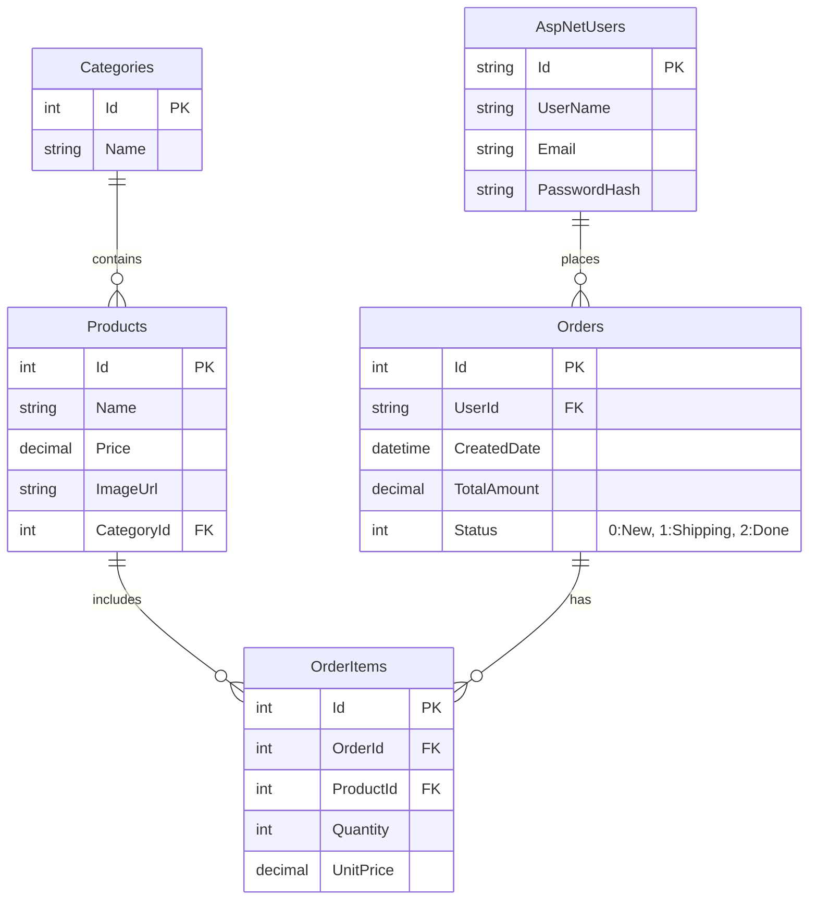

# 🗄️ CƠ SỞ DỮ LIỆU DNU SHOP

## 1. Sơ đồ ERD (Entity Relationship Diagram)



## 2. Giải thích bảng

### 2.1. AspNetUsers (Người dùng - Identity)

**Mô tả:** Bảng quản lý người dùng, sử dụng ASP.NET Core Identity.

**Các trường quan trọng:**
- `Id` (string, PK): GUID, unique identifier
- `Email` (string, unique): Email đăng nhập
- `PasswordHash` (string): Mật khẩu đã hash (bcrypt)
- `FullName` (string): Họ và tên
- `CreatedDate` (datetime): Ngày tạo tài khoản
- `IsActive` (bool): Trạng thái hoạt động

**Business Rules:**
- Email phải unique
- Password phải được hash trước khi lưu
- Mặc định `IsActive = true`

### 2.2. Categories (Danh mục)

**Mô tả:** Danh mục sản phẩm (Điện thoại, Laptop, Phụ kiện...)

**Các trường:**
- `Id` (int, PK, Identity): Tự động tăng
- `Name` (string, required, max 100): Tên danh mục
- `Description` (string, nullable, max 500): Mô tả
- `CreatedDate` (datetime): Ngày tạo

**Ví dụ dữ liệu:**
```
Id | Name          | Description
1  | Điện thoại    | Các loại điện thoại
2  | Laptop        | Máy tính xách tay
3  | Phụ kiện      | Phụ kiện điện tử
```

### 2.3. Products (Sản phẩm)

**Mô tả:** Thông tin sản phẩm

**Các trường:**
- `Id` (int, PK, Identity): Tự động tăng
- `Name` (string, required, max 100): Tên sản phẩm
- `Description` (string, nullable, max 500): Mô tả chi tiết
- `Price` (decimal(18,2), required): Giá bán (VD: 20000000.00)
- `ImageUrl` (string, nullable): Đường dẫn ảnh (VD: `/images/products/iphone15.jpg`)
- `Stock` (int, default 0): Số lượng tồn kho
- `CategoryId` (int, FK → Categories): Danh mục
- `CreatedDate` (datetime): Ngày tạo
- `UpdatedDate` (datetime, nullable): Ngày cập nhật
- `IsDeleted` (bool, default false): Soft delete flag

**Business Rules:**
- `Price`: Kiểu `decimal(18,2)` để tránh sai số tiền tệ (không dùng float)
- `ImageUrl`: Lưu đường dẫn tương đối, không lưu full URL
- `Stock`: Phải >= 0
- `IsDeleted`: Soft delete, không xóa thật khỏi database

**Ví dụ dữ liệu:**
```
Id | Name        | Price      | Stock | CategoryId | IsDeleted
1  | iPhone 15   | 20000000   | 10    | 1         | false
2  | Samsung S24 | 18000000   | 5     | 1         | false
```

### 2.4. Orders (Đơn hàng)

**Mô tả:** Thông tin đơn hàng

**Các trường:**
- `Id` (int, PK, Identity): Tự động tăng
- `UserId` (string, FK → AspNetUsers): Người đặt hàng (nullable - cho phép đặt hàng không cần đăng nhập)
- `OrderDate` (datetime): Ngày đặt hàng
- `TotalAmount` (decimal(18,2)): Tổng tiền đơn hàng
- `Status` (int): Trạng thái (0=New, 1=Shipping, 2=Completed, 3=Cancelled)
- `ShippingName` (string, required): Tên người nhận
- `ShippingPhone` (string, required): Số điện thoại
- `ShippingAddress` (string, required): Địa chỉ giao hàng
- `CreatedDate` (datetime): Ngày tạo
- `UpdatedDate` (datetime, nullable): Ngày cập nhật

**Business Rules:**
- `Status`: Dùng Enum trong C# để quản lý
  - 0: New (Mới)
  - 1: Shipping (Đang giao)
  - 2: Completed (Hoàn thành)
  - 3: Cancelled (Hủy)
- `TotalAmount`: Tổng tiền đơn hàng (đã trừ khuyến mãi nếu có)
- Chỉ có thể chuyển trạng thái theo thứ tự: New → Shipping → Completed
- New có thể chuyển trực tiếp sang Cancelled

**Ví dụ dữ liệu:**
```
Id | UserId | OrderDate           | TotalAmount | Status | ShippingName
1  | user-1 | 2024-01-01 10:00:00 | 20000000   | 0      | Nguyễn Văn A
2  | user-2 | 2024-01-02 14:30:00 | 36000000   | 1      | Trần Thị B
```

### 2.5. OrderItems (Chi tiết đơn hàng)

**Mô tả:** Chi tiết từng sản phẩm trong đơn hàng

**Các trường:**
- `Id` (int, PK, Identity): Tự động tăng
- `OrderId` (int, FK → Orders): Mã đơn hàng
- `ProductId` (int, FK → Products): Mã sản phẩm
- `ProductName` (string): Tên sản phẩm tại thời điểm mua (snapshot)
- `Quantity` (int): Số lượng
- `UnitPrice` (decimal(18,2)): Giá tại thời điểm mua (snapshot)
- `Subtotal` (decimal(18,2)): Thành tiền (Quantity × UnitPrice)

**Business Rules:**
- `ProductName` và `UnitPrice`: Lưu snapshot tại thời điểm mua
  - Lý do: Giá sản phẩm có thể thay đổi sau này
  - Đảm bảo tính chính xác của đơn hàng
- `Quantity`: Phải > 0
- `Subtotal`: Tự động tính = Quantity × UnitPrice

**Ví dụ dữ liệu:**
```
Id | OrderId | ProductId | ProductName | Quantity | UnitPrice  | Subtotal
1  | 1       | 1         | iPhone 15   | 1        | 20000000   | 20000000
2  | 2       | 1         | iPhone 15   | 1        | 20000000   | 20000000
3  | 2       | 2         | Samsung S24 | 2        | 18000000   | 36000000
```

---

## 3. Relationships (Quan hệ)

### 3.1. One-to-Many

**Categories → Products**
- 1 Category có nhiều Products
- 1 Product thuộc 1 Category

**AspNetUsers → Orders**
- 1 User có nhiều Orders
- 1 Order thuộc 1 User (hoặc null nếu không đăng nhập)

**Orders → OrderItems**
- 1 Order có nhiều OrderItems
- 1 OrderItem thuộc 1 Order

**Products → OrderItems**
- 1 Product có nhiều OrderItems (trong các đơn hàng khác nhau)
- 1 OrderItem tham chiếu 1 Product

### 3.2. Foreign Keys

```sql
-- Products → Categories
ALTER TABLE Products
ADD CONSTRAINT FK_Products_Categories
FOREIGN KEY (CategoryId) REFERENCES Categories(Id);

-- Orders → AspNetUsers
ALTER TABLE Orders
ADD CONSTRAINT FK_Orders_Users
FOREIGN KEY (UserId) REFERENCES AspNetUsers(Id);

-- OrderItems → Orders
ALTER TABLE OrderItems
ADD CONSTRAINT FK_OrderItems_Orders
FOREIGN KEY (OrderId) REFERENCES Orders(Id);

-- OrderItems → Products
ALTER TABLE OrderItems
ADD CONSTRAINT FK_OrderItems_Products
FOREIGN KEY (ProductId) REFERENCES Products(Id);
```

---

## 4. Indexes (Chỉ mục)

Indexes giúp tăng tốc độ truy vấn:

```sql
-- Index cho tìm kiếm sản phẩm theo tên
CREATE INDEX IX_Products_Name ON Products(Name);

-- Index cho lọc theo danh mục
CREATE INDEX IX_Products_CategoryId ON Products(CategoryId);

-- Index cho tìm kiếm sản phẩm đã xóa
CREATE INDEX IX_Products_IsDeleted ON Products(IsDeleted);

-- Index cho tìm đơn hàng theo user
CREATE INDEX IX_Orders_UserId ON Orders(UserId);

-- Index cho lọc đơn hàng theo trạng thái
CREATE INDEX IX_Orders_Status ON Orders(Status);

-- Index cho tìm order items theo đơn hàng
CREATE INDEX IX_OrderItems_OrderId ON OrderItems(OrderId);
```

---

## 5. Constraints (Ràng buộc)

### 5.1. Check Constraints

```sql
-- Giá sản phẩm phải >= 0
ALTER TABLE Products
ADD CONSTRAINT CK_Products_Price
CHECK (Price >= 0);

-- Số lượng tồn kho phải >= 0
ALTER TABLE Products
ADD CONSTRAINT CK_Products_Stock
CHECK (Stock >= 0);

-- Tổng tiền đơn hàng phải >= 0
ALTER TABLE Orders
ADD CONSTRAINT CK_Orders_TotalAmount
CHECK (TotalAmount >= 0);

-- Số lượng trong order item phải > 0
ALTER TABLE OrderItems
ADD CONSTRAINT CK_OrderItems_Quantity
CHECK (Quantity > 0);
```

### 5.2. Unique Constraints

```sql
-- Email phải unique (đã có trong Identity)
-- Tên sản phẩm không được trùng (optional)
CREATE UNIQUE INDEX IX_Products_Name_Unique
ON Products(Name)
WHERE IsDeleted = 0;
```

---

## 6. Sample Data (Dữ liệu mẫu)

### 6.1. Categories

```sql
INSERT INTO Categories (Name, Description, CreatedDate) VALUES
('Điện thoại', 'Các loại điện thoại thông minh', GETDATE()),
('Laptop', 'Máy tính xách tay', GETDATE()),
('Phụ kiện', 'Phụ kiện điện tử', GETDATE());
```

### 6.2. Products

```sql
INSERT INTO Products (Name, Price, Description, CategoryId, Stock, CreatedDate) VALUES
('iPhone 15', 20000000, 'iPhone mới nhất với chip A17 Pro', 1, 10, GETDATE()),
('Samsung S24', 18000000, 'Samsung Galaxy S24 Ultra', 1, 5, GETDATE()),
('MacBook Pro M3', 45000000, 'MacBook Pro 14 inch M3', 2, 3, GETDATE());
```

---

## 7. Views (Khung nhìn)

### 7.1. View: ProductSummary

```sql
CREATE VIEW ProductSummary AS
SELECT 
    p.Id,
    p.Name,
    p.Price,
    p.Stock,
    c.Name AS CategoryName,
    COUNT(oi.Id) AS TotalOrders,
    SUM(oi.Quantity) AS TotalSold
FROM Products p
LEFT JOIN Categories c ON p.CategoryId = c.Id
LEFT JOIN OrderItems oi ON p.Id = oi.ProductId
WHERE p.IsDeleted = 0
GROUP BY p.Id, p.Name, p.Price, p.Stock, c.Name;
```

---

## 8. Stored Procedures (Thủ tục lưu trữ)

### 8.1. GetTopProducts

```sql
CREATE PROCEDURE GetTopProducts
    @Limit INT = 10
AS
BEGIN
    SELECT TOP (@Limit)
        p.Id,
        p.Name,
        SUM(oi.Quantity) AS TotalSold,
        SUM(oi.Subtotal) AS TotalRevenue
    FROM Products p
    INNER JOIN OrderItems oi ON p.Id = oi.ProductId
    INNER JOIN Orders o ON oi.OrderId = o.Id
    WHERE o.Status = 2 -- Completed
    GROUP BY p.Id, p.Name
    ORDER BY TotalSold DESC;
END;
```

---

## 9. Kết luận

Database được thiết kế:
- ✅ Normalized (Chuẩn hóa)
- ✅ Có Foreign Keys và Constraints
- ✅ Có Indexes để tối ưu performance
- ✅ Soft Delete cho Products
- ✅ Snapshot data trong OrderItems
- ✅ Sẵn sàng cho production

